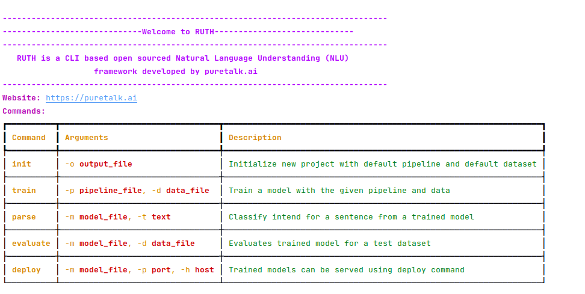

# Ruth-Cli

Ruth Cli is a command line interface for Ruth. It is used to train, test, and run Ruth models.

## Installation

To install Ruth Cli, run the following command:

```bash
pip install ruth-nlu
```

## Initialize Ruth 

To initialize Ruth, run the following command:

```bash
ruth init
```
the output will be as follows:

</img>

## Usage

### Train

To train a Ruth model, run the following command:

```bash
ruth train -d path/to/training_data.json -p path/to/pipeline.yml
```

### parse

To test a Ruth model, run the following command:

```bash
ruth parse -m path/to/model -t <text>
```
for example,

```bash
ruth parse -m model -t "I want to book a flight"
```
### Evaluate

To evaluate a Ruth model, run the following command:

```bash
ruth evaluate -m path/to/model -d path/to/test_data.json
```

